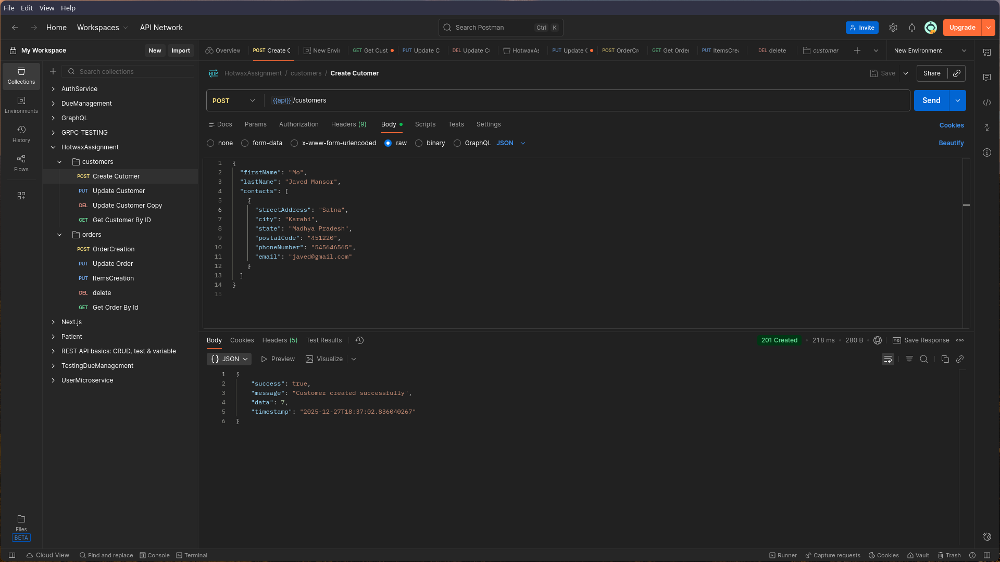
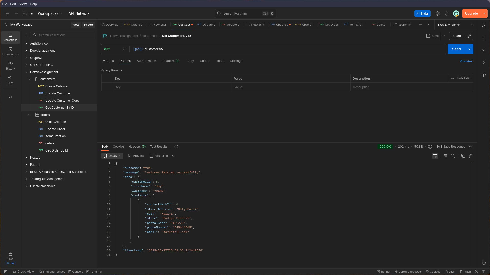
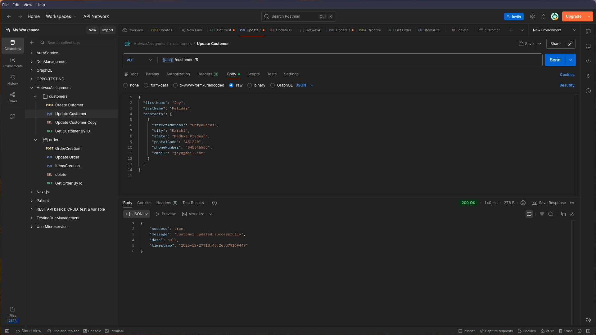
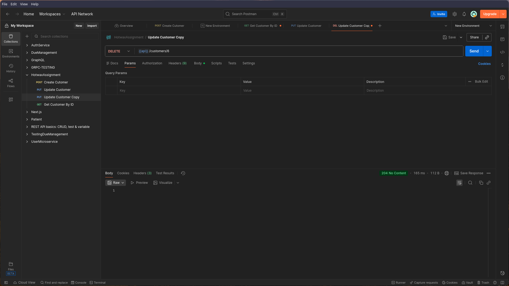
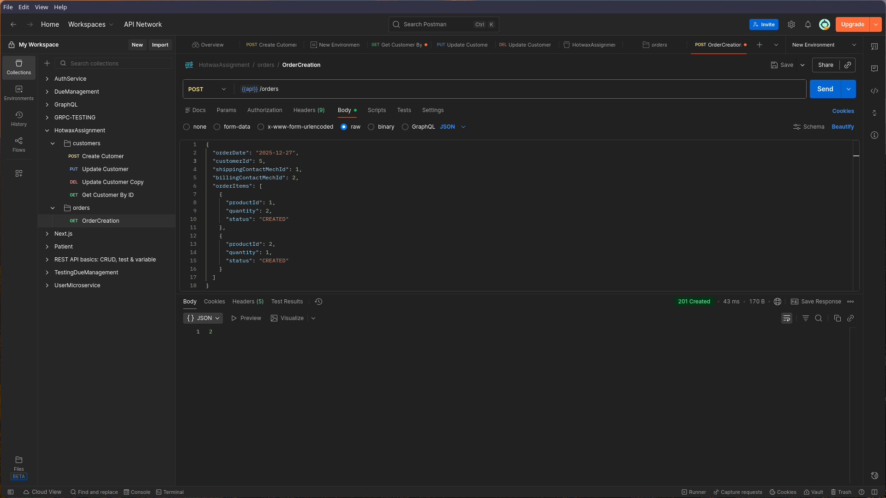
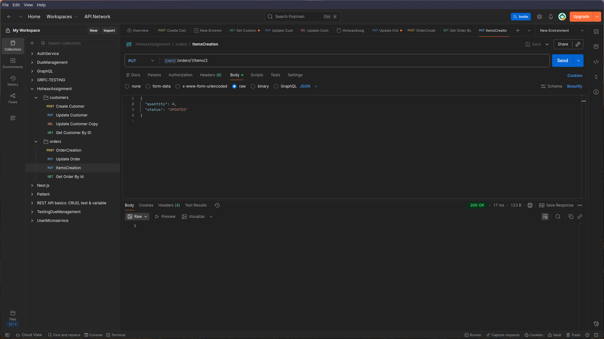
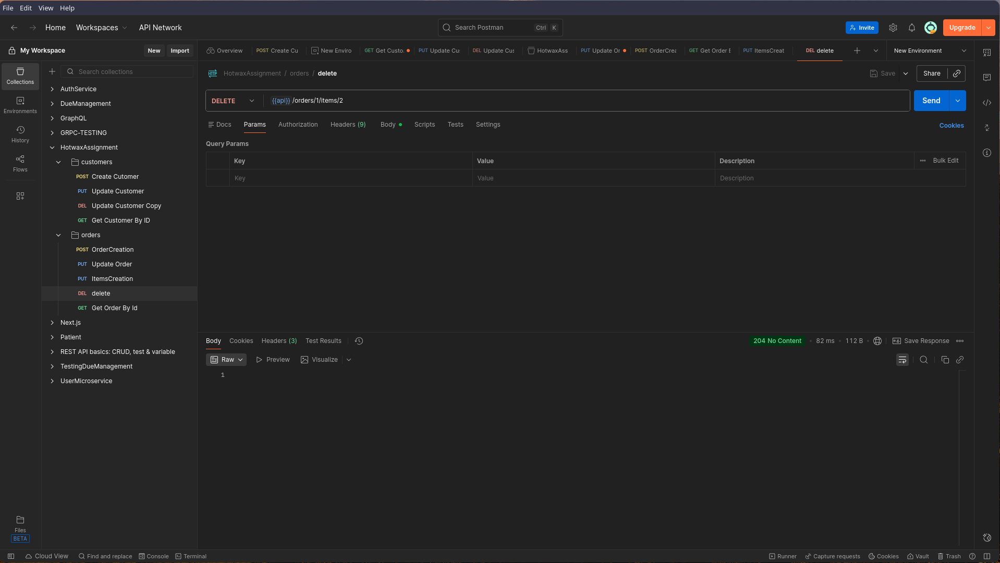

# E-Commerce Order Management API – What the APIs Do

This backend application provides REST APIs to manage **customers**, **orders**, and **order items** for a simple e-commerce system.

Below is a **plain, human‑friendly explanation** of what each API does.

---

## 👤 Customer APIs

### 1. Create Customer – `POST /customers`

This API creates a new customer in the system.

You provide:

* First name
* Last name
* Contact details (address, city, state, postal code, phone, email)

**Example use:**

> When a new user signs up or is registered in the system.

<em>Create Customer</em>

---

### 2. Get Customer Details – `GET /customers/{customerId}`

This API fetches customer information using the customer ID.

It returns:

* Customer name
* All contact addresses linked to the customer

**Example use:**

> To view customer profile or address details.

<em>Get Customer by ID</em>

---

### 3. Update Customer – `PUT /customers/{customerId}`

This API updates basic customer information.

You can update:

* First name
* Last name

**Example use:**

> When a customer edits their profile details.

<em>Update Customer</em>

---

### 4. Delete Customer – `DELETE /customers/{customerId}`

This API removes a customer from the system.

**Example use:**

> When a customer account is permanently deleted.

<em>Delete Customer by ID</em>

---

## 🛒 Order APIs

### 5. Create Order – `POST /orders`

This API creates a new order for a customer.

You provide:

* Order date
* Customer ID
* Shipping address ID
* Billing address ID
* List of products with quantity and status

**Example use:**

> When a customer places a new order.

<em>Order Creation</em>

---

### 6. Get Order Details – `GET /orders/{orderId}`

This API retrieves full details of an order.

It returns:

* Order information
* Customer details
* Shipping and billing address
* All items in the order

**Example use:**

> To show order summary or order tracking information.

<em>Get Order by ID</em>

---

### 7. Update Order – `PUT /orders/{orderId}`

This API updates an existing order.

You can update:

* Shipping address
* Billing address

**Example use:**

> When a customer changes delivery or billing address after ordering.

<em>Update Order</em>

---

### 8. Delete Order – `DELETE /orders/{orderId}`

This API deletes an order completely.

All order items linked to the order are also deleted automatically.

**Example use:**

> When an order is cancelled.

<em>Delete Order</em>

---

## 📦 Order Item APIs

### 9. Add Item to Order – `POST /orders/{orderId}/items`

This API adds a new product to an existing order.

You provide:

* Product ID
* Quantity
* Status

**Example use:**

> When a customer adds another product to the same order.

<em>Item Creation</em>

---

### 10. Update Order Item – `PUT /orders/{orderId}/items/{itemId}`

This API updates a specific item in an order.

You can update:

* Quantity
* Status

**Example use:**

> When a customer changes the quantity of a product.

<em>Update Order Item</em>

---

### 11. Delete Order Item – `DELETE /orders/{orderId}/items/{itemId}`

This API removes a product from an order.

**Example use:**

> When a customer removes an item from their order.

<em>Delete Order Item</em>

---

## ⚠️ Error Handling

All APIs return **clear and user‑friendly error messages** if:

* Required data is missing
* Invalid data is provided
* A resource is not found
* Request format is incorrect

---

## 🎯 Summary

* Customer APIs manage users and their contact details
* Order APIs manage the overall order
* Order Item APIs manage individual products inside an order
* The system supports full **CRUD (Create, Read, Update, Delete)** operations

---

**Project Type:** Back end Assignment / Academic Project